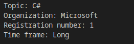
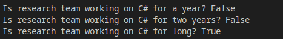
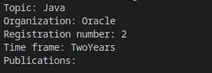
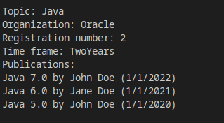
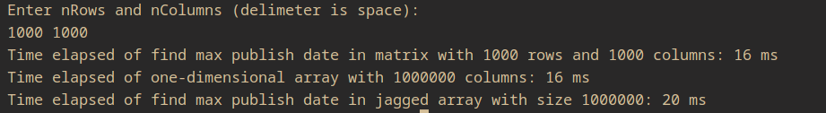
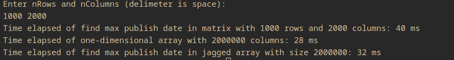

# Лабораторна робота № 1

## Результати виконання

- Створити один об’єкт типу ResearchTeam, перетворити дані в текстовий вигляд за допомогою методу `ToShortString()` та вивести дані

- вивести значення індексатора для значень індекса `TimeFrame.Year`, `TimeFrame.TwoYears`, `TimeFrame.Long`

- присвоїти значення в типі ResearchTeam властивостям, перетворити дані в текстовий вигляд за допомогою методу `ToString()`

- за допомогою методу `AddPapers(params Paper[])` добавити лементи в список публікацій та вивести дані об'єкту `ResearchTeam`

- вивести значення властивості, яка повертає посилання на публікацію, яка вийшла останньою

- порівняти час виконання операцій з елементами одновимірного, двовимірного прямокутного, та двовимірних зубчастих масивів з однаковим числом елементів типу `Paper`

